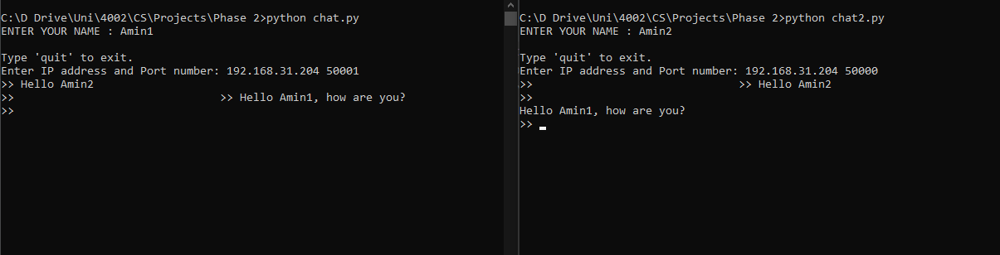

# P2P_Chat_With_AES
This is about a P2P chat which the messages are encrypted by AES algorithm
In this project, I use Crypto.Cipher library for encrypting messages with AES, use the threading library for sending and receiving messages at the same time, and the socket library for setting IP Addresses and port numbers.
